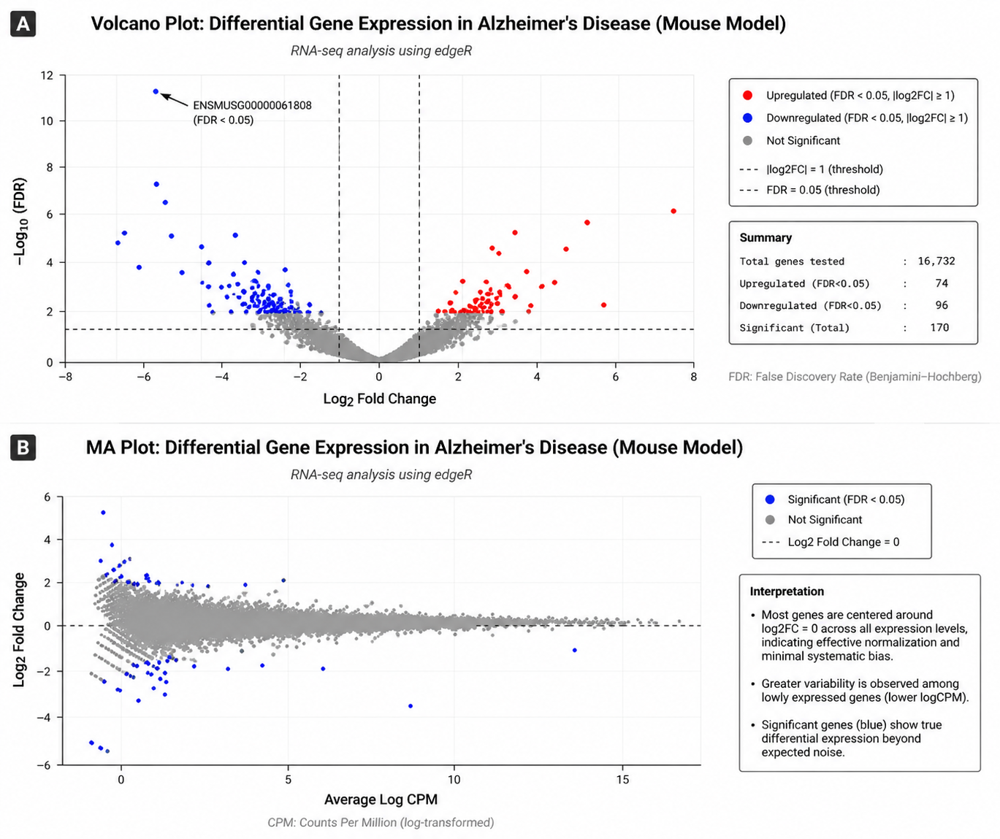

# RNA-seq Analysis for Identification of Diagnostic Genes in Alzheimer’s Disease

## 📌 Overview
Alzheimer’s disease (AD) is a progressive neurodegenerative disorder characterized by cognitive decline and complex molecular alterations, including neuroinflammation and synaptic dysfunction. This project leverages publicly available RNA-seq data to identify differentially expressed genes (DEGs) associated with Alzheimer’s disease using a reproducible bioinformatics pipeline.

---

## 🎯 Objective
To perform differential gene expression analysis on RNA-seq data from Alzheimer’s disease mouse models and identify candidate genes that may serve as potential biomarkers or therapeutic targets.

---

## 📂 Dataset
- **Source:** NCBI Gene Expression Omnibus (GEO)  
- **Type:** RNA-seq (Mouse model)  
- **Samples:** Control vs Disease  
- **Accession IDs:** SRR11596834, SRR11596836  
- **Data Retrieval Tool:** SRA Toolkit  

---

## ⚙️ Methodology / Workflow

The analysis follows a standard RNA-seq pipeline:

1. **Data Retrieval**  
   RNA-seq data downloaded from NCBI GEO using SRA Toolkit  

2. **Quality Control**  
   Raw reads assessed and trimmed using Trimmomatic  

3. **Read Alignment**  
   Clean reads aligned to the mouse reference genome using Bowtie2  

4. **Post-processing**  
   SAMtools used for format conversion, sorting, and duplicate removal  

5. **Quantification**  
   Gene-level counts generated using featureCounts  

6. **Differential Expression Analysis**  
   edgeR used to identify differentially expressed genes (DEGs)  

7. **Functional Enrichment**  
   GO and KEGG pathway analysis performed on DEGs  

---

## 🧪 Tools & Technologies

- SRA Toolkit  
- FastQC  
- Trimmomatic  
- Bowtie2  
- SAMtools  
- featureCounts  
- R (edgeR, ggplot2)  

---

## 🔁 Reproducibility

To reproduce this analysis:

1. Download raw data using SRA Toolkit  
2. Perform quality trimming using Trimmomatic  
3. Align reads using Bowtie2  
4. Process alignment files using SAMtools  
5. Generate count matrix using featureCounts  
6. Run differential expression analysis in R using edgeR  

*Note: Scripts and commands are provided in the repository.*

---

## 📊 Results

Differential gene expression analysis identified several upregulated and downregulated genes.

After multiple testing correction (FDR < 0.05), one gene (**ENSMUSG00000061808**) remained statistically significant.

ENSMUSG00000061808 is the mouse ortholog of human gene **KIAA1109**.

### 📈 Key Visualizations

## 📈 Key Visualizations

**Figure 1:**  
(A) Volcano plot showing differentially expressed genes with FDR < 0.05.  
(B) MA plot showing log fold change vs average expression.  
The gene ENSMUSG00000061808 is significantly downregulated.

Additional outputs include:
- Gene Ontology (GO) enrichment plots  
- KEGG pathway enrichment analysis  

---

## 🔬 Key Findings

- Significant downregulation of ENSMUSG00000061808 suggests a potential role in:
  - Immune system regulation  
  - Neurodegenerative pathways  

- Functional enrichment analysis indicates involvement of:
  - Neuroinflammation  
  - Synaptic dysfunction  
  - Cellular component and molecular function alterations  

---

## ⚠️ Limitations

- Most genes did not pass multiple testing correction (FDR), likely due to:
  - Limited sample size  
  - Biological variability  

- Results should be validated with:
  - Larger datasets  
  - Additional experimental studies  

---

## 🚀 Conclusion

This study demonstrates the effectiveness of integrating publicly available RNA-seq datasets with a standardized bioinformatics workflow to uncover candidate genes associated with Alzheimer’s disease. The findings provide a foundation for further functional validation and biomarker discovery.

---

## 📁 Repository Structure

---

## 📌 Future Work

- Increase sample size for improved statistical power  
- Integrate multi-omics data (proteomics, epigenomics)  
- Validate candidate genes in human datasets  
- Explore machine learning approaches for biomarker prediction  

---

## 👤 Author

**Chirabrata Debnath**  
M.Sc. Biotechnology  
Chandigarh University  

---

## 📎 Acknowledgment

This work was carried out using publicly available datasets from NCBI GEO and standard bioinformatics tools.
